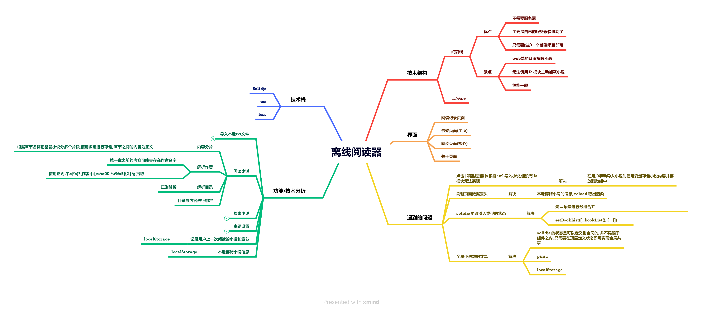
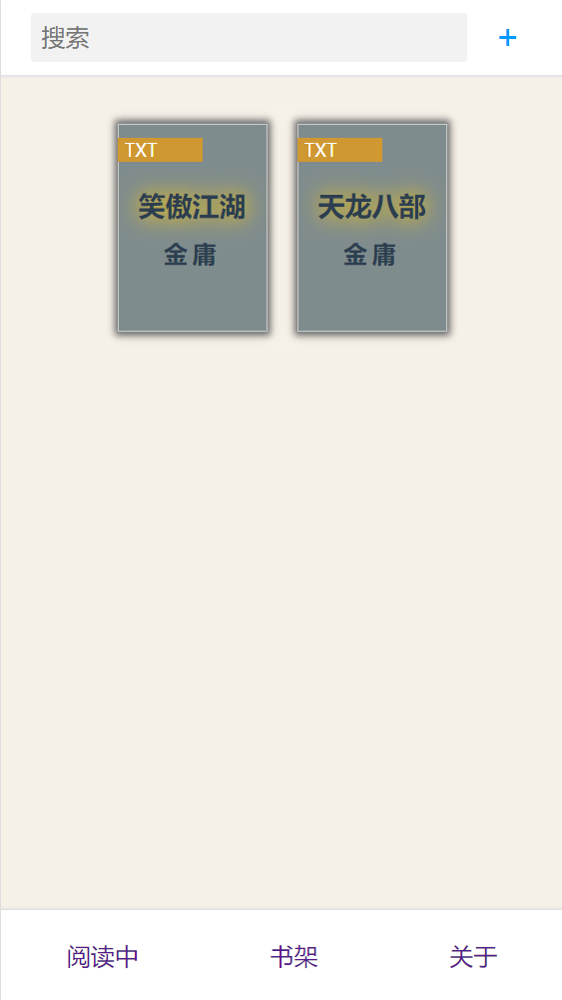
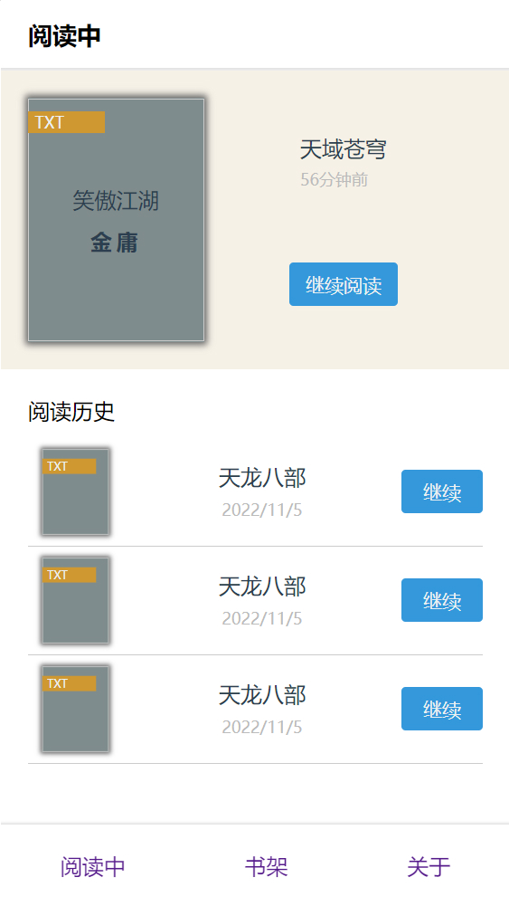
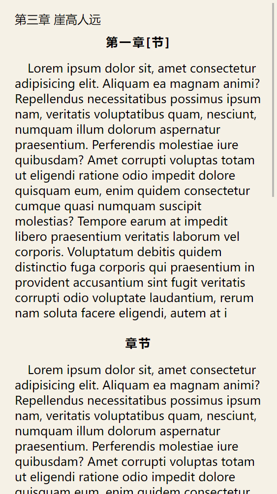

# 使用 SolidJs 开发的一款离线小说阅读器

### Node version

- 16.14.1

---

### 开发大纲



---

### 功能 Todo

- 导入本地小说
- 阅读小说
- 黑夜主题
- 阅读历史
- 阅读设置

---

### 效果图

<br/>

**书架界面**:



**阅读历史**



**阅读器**



**阅读设置**


---

### 运行

```sh
pnpm i
```

```sh
yarn dev
```

```sh
yarn build
```
